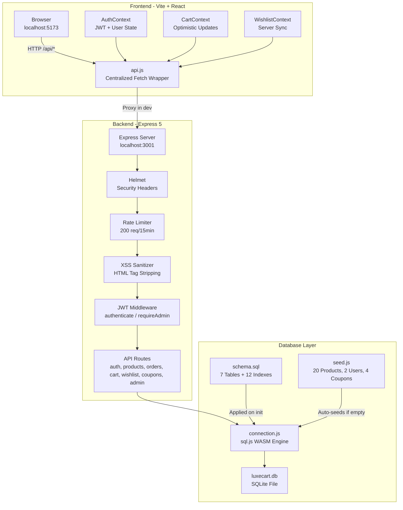
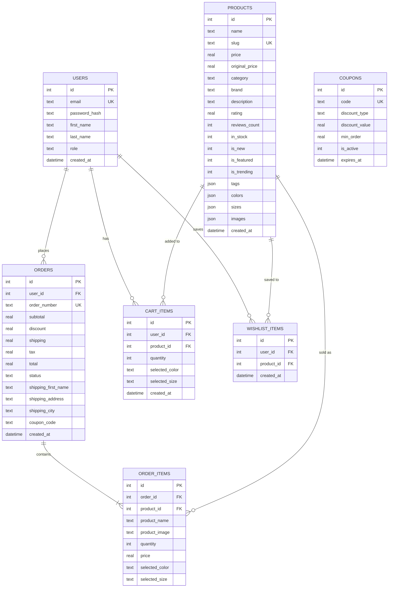
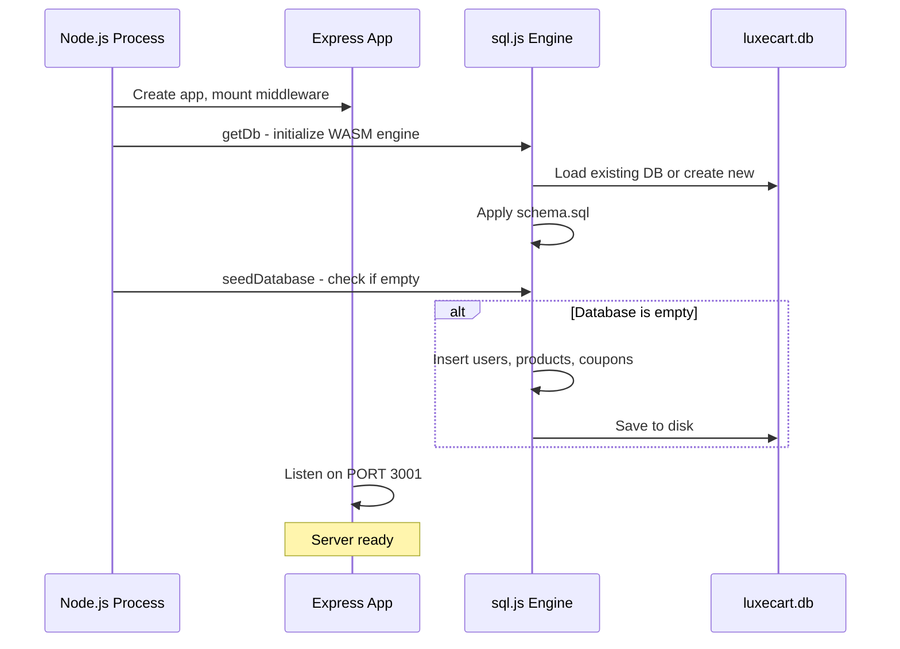
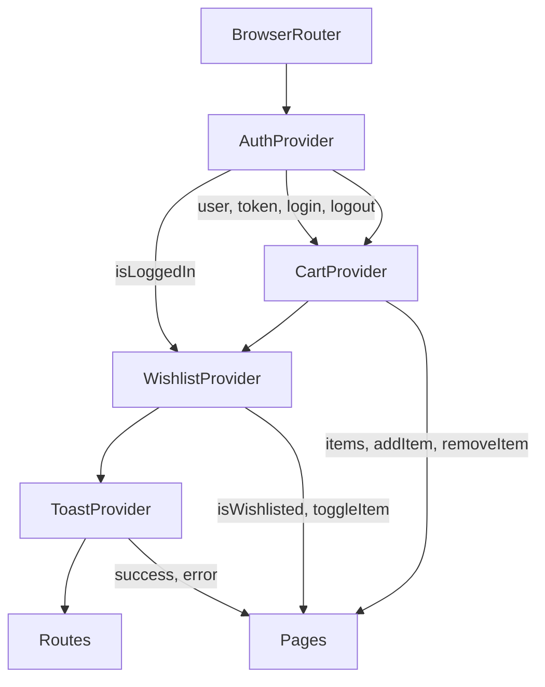
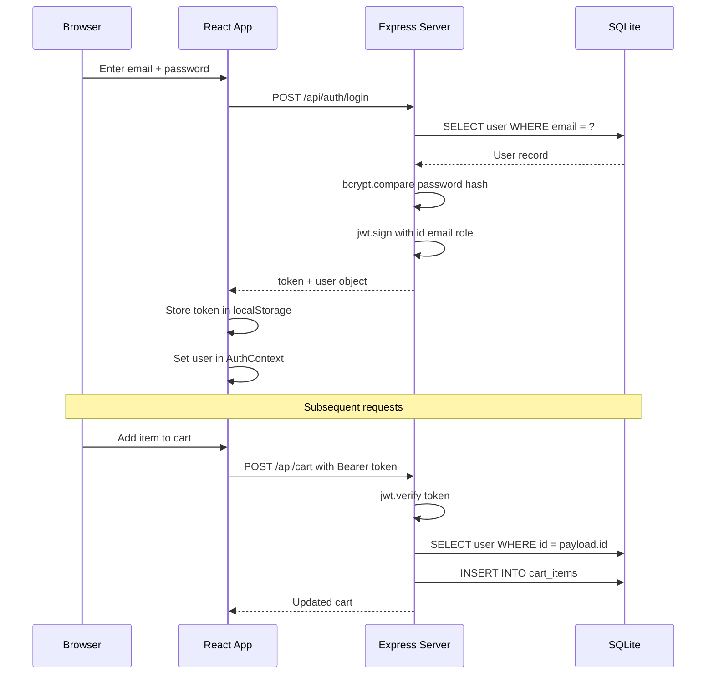
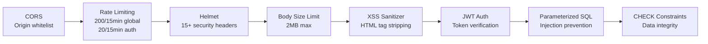
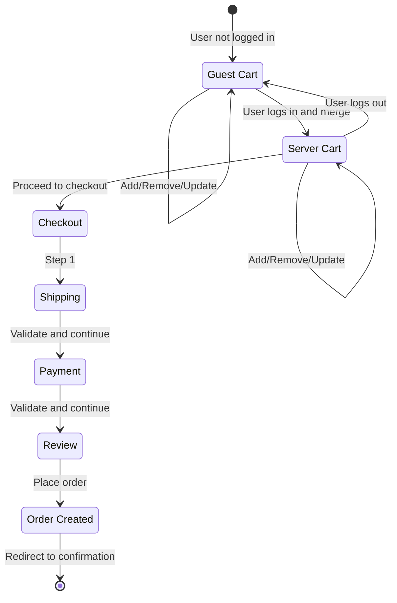

# LuxeCart — Technical Documentation

> **Version**: 1.0.0  
> **Last Updated**: September 2026  
> **Stack**: React 19 + Vite 8 | Express 5 + SQLite (sql.js) | JWT Authentication

---

## Table of Contents

1. [Project Overview](#1-project-overview)
2. [Why This Tech Stack](#2-why-this-tech-stack)
3. [System Architecture](#3-system-architecture)
4. [Project Structure](#4-project-structure)
5. [Database Design](#5-database-design)
6. [Backend — API Server](#6-backend--api-server)
7. [Frontend — React SPA](#7-frontend--react-spa)
8. [Authentication & Authorization](#8-authentication--authorization)
9. [Security Implementation](#9-security-implementation)
10. [Admin Panel](#10-admin-panel)
11. [Cart & Checkout Flow](#11-cart--checkout-flow)
12. [API Reference](#12-api-reference)
13. [Running the Project](#13-running-the-project)
14. [Deployment Guide](#14-deployment-guide)
15. [Future Roadmap](#15-future-roadmap)

---

## 1. Project Overview

LuxeCart is a **production-ready SaaS e-commerce platform** built as a premium fashion and lifestyle storefront. It serves as both a functional prototype and a deployable product, featuring:

- **Storefront** — browsable product catalog with search, filtering, sorting, and wishlisting
- **Customer accounts** — registration, login, order history, server-synced cart and wishlist
- **Checkout flow** — multi-step checkout with shipping, payment (demo), order confirmation
- **Admin dashboard** — revenue analytics, product CRUD, order management with status updates
- **Real-time data** — everything backed by a SQLite database via a RESTful API

### Key Design Principles

| Principle | Implementation |
|---|---|
| **Dark-mode first** | HSL color system with glassmorphism and gradient accents |
| **Mobile responsive** | Fluid layouts, mobile filter drawers, collapsible navigation |
| **Optimistic UI** | Cart/wishlist update instantly, sync with server in background |
| **Zero-config database** | SQLite runs in-process, no external DB server required |
| **Prototype-ready** | Ships with 20 real products, images, and seeded demo accounts |

---

## 2. Why This Tech Stack

### Frontend: React 19 + Vite 8

| Choice | Reasoning |
|---|---|
| **React 19** | Industry standard for SPAs. Hooks + Context API provide clean state management without Redux overhead. React 19's improved rendering and batching reduce re-renders. |
| **Vite 8** | Near-instant HMR (<100ms). Native ES module support means no bundling during dev. Production builds use Rollup for optimal code splitting. 10-100x faster than Webpack. |
| **React Router v7** | File-path based routing with nested layouts. `useSearchParams` for URL-synced filters. Dynamic route params for product slugs and order IDs. |
| **Vanilla CSS** | Full control over the design system. No Tailwind lock-in. CSS custom properties enable theming. Under 78 KB total CSS (gzipped: 12 KB). |

### Backend: Express 5 + SQLite (sql.js)

| Choice | Reasoning |
|---|---|
| **Express 5** | The de facto Node.js framework. v5 adds native async error handling, improved routing, and built-in Promise support. Massive ecosystem of middleware. |
| **SQLite via sql.js** | **Zero-config database** — no PostgreSQL/MySQL server to install or manage. The entire DB is a single file (`luxecart.db`). sql.js compiles SQLite to WebAssembly, running entirely in-process with no native binaries needed. Perfect for prototypes, demos, and small-to-medium deployments. |
| **JWT (jsonwebtoken)** | Stateless authentication. Tokens encode user ID + role, eliminating session storage. 7-day expiry balances security and UX. |
| **bcryptjs** | Pure JavaScript bcrypt implementation. 12-round salt factor makes brute-force attacks computationally infeasible (~250ms per hash). |

### Why NOT other options?

| Alternative | Why We Didn't Use It |
|---|---|
| **Next.js** | Adds SSR/SSG complexity unnecessary for a SaaS dashboard. Client-side rendering with Vite is simpler and faster to iterate on. |
| **PostgreSQL/MySQL** | Requires a separate database server, connection pooling, and deployment configuration. SQLite is sufficient for this scale and eliminates DevOps overhead. |
| **Redux/Zustand** | React Context + useReducer provides equivalent functionality for this app's state complexity without additional dependencies. |
| **Prisma/Sequelize** | ORMs add abstraction layers. Direct SQL gives us full control and is more educational for understanding the data flow. |
| **Firebase/Supabase** | Vendor lock-in. Self-hosted SQLite means the entire application is portable and runs anywhere Node.js runs. |

---

## 3. System Architecture



### Request Lifecycle

```
Browser -> Vite Dev Proxy (/api -> :3001) -> Express
  -> Helmet (security headers)
  -> CORS (origin whitelist)
  -> Rate Limiter (200 req/15min, 20 for auth)
  -> JSON Parser (2MB limit)
  -> XSS Sanitizer (strip HTML tags)
  -> JWT Authentication (if protected route)
  -> Route Handler (business logic)
  -> SQLite Query (parameterized)
  -> JSON Response -> Browser
```

---

## 4. Project Structure

```
ecom/
├── public/                       # Static assets
├── src/                          # Frontend source
│   ├── api.js                    # Centralized API client (fetch wrapper)
│   ├── App.jsx                   # Root component with routing
│   ├── main.jsx                  # React DOM entry point
│   ├── index.css                 # Global design system (CSS custom properties)
│   ├── context/
│   │   ├── AuthContext.jsx       # Authentication state + API calls
│   │   ├── CartContext.jsx       # Cart state with server sync
│   │   ├── WishlistContext.jsx   # Wishlist state with server sync
│   │   └── ToastContext.jsx      # Toast notification system
│   ├── components/
│   │   ├── layout/
│   │   │   ├── Header.jsx        # Navigation bar
│   │   │   ├── Footer.jsx        # Site footer
│   │   │   └── Layout.jsx        # Page wrapper
│   │   ├── sections/
│   │   │   ├── HeroBanner.jsx    # Homepage hero
│   │   │   ├── FeaturedProducts.jsx  # Featured grid (API)
│   │   │   ├── Categories.jsx    # Category cards
│   │   │   └── PromoBar.jsx      # Promotional banner
│   │   └── ui/
│   │       ├── ProductCard.jsx   # Reusable product card
│   │       └── Newsletter.jsx    # Email signup section
│   ├── pages/
│   │   ├── Home.jsx              # Landing page
│   │   ├── ProductList.jsx       # Catalog with filters & sorting
│   │   ├── ProductDetail.jsx     # Single product view
│   │   ├── Cart.jsx              # Shopping cart
│   │   ├── Checkout.jsx          # Multi-step checkout
│   │   ├── OrderConfirmation.jsx # Post-purchase confirmation
│   │   ├── Login.jsx             # Auth page (login/register)
│   │   ├── Account.jsx           # User profile + order history
│   │   ├── Wishlist.jsx          # Saved items
│   │   ├── Search.jsx            # Search results
│   │   ├── Admin.jsx             # Admin dashboard
│   │   └── InfoPages.jsx         # Help, shipping, returns, size guide
│   └── data/
│       └── products.js           # Static filter options + review data
│
├── server/                       # Backend source
│   ├── index.js                  # Express entry point + middleware stack
│   ├── .env                      # Environment variables
│   ├── package.json              # Server dependencies
│   ├── middleware/
│   │   └── auth.js               # JWT verification + role guards
│   ├── routes/
│   │   ├── auth.js               # POST /register, POST /login, GET /me
│   │   ├── products.js           # GET list, featured, trending, by slug
│   │   ├── orders.js             # POST create, GET list, GET by number
│   │   ├── cart.js               # GET, POST, PUT, DELETE, POST /merge
│   │   ├── wishlist.js           # GET, POST, DELETE
│   │   ├── coupons.js            # POST /validate
│   │   └── admin.js              # Stats, orders, products CRUD
│   └── db/
│       ├── schema.sql            # Full database schema
│       ├── connection.js         # sql.js engine + query helpers
│       ├── seed.js               # Demo data seeder
│       └── luxecart.db           # SQLite database file (auto-created)
│
├── vite.config.js                # Vite config with API proxy
├── package.json                  # Frontend dependencies
└── index.html                    # HTML entry point
```

---

## 5. Database Design

### Entity-Relationship Diagram



### Schema Design Decisions

| Decision | Rationale |
|---|---|
| **Order items snapshot product data** | If a product is deleted or price changes, historical orders retain the original name, image, and price at time of purchase. `product_id` uses `ON DELETE SET NULL` so the record persists. |
| **JSON arrays for product variants** | Colors, sizes, tags, and images are stored as JSON text. SQLite doesn't have native arrays, but JSON is flexible and parsed at the application layer. Avoids needing junction tables for simple lists. |
| **`COLLATE NOCASE` on email/coupon** | Case-insensitive matching ensures `Admin@LuxeCart.com` and `admin@luxecart.com` resolve to the same record without application-layer normalization. |
| **Composite UNIQUE on cart items** | `UNIQUE(user_id, product_id, selected_color, selected_size)` prevents duplicate cart entries for the same variant. Adding a second "Black / M" item increments quantity instead. |
| **12 indexes** | Strategic indexes on foreign keys (`user_id`, `order_id`), lookup fields (`slug`, `email`, `order_number`), and filter fields (`category`, `brand`, `is_featured`, `is_trending`) ensure sub-millisecond query times. |
| **CHECK constraints** | Database-level validation: prices can't be negative, quantities must be 1-10, status must be a valid enum, ratings must be 0-5. Defense in depth beyond application validation. |
| **CASCADE deletes** | Deleting a user cascades to their orders, cart, and wishlist. Deleting a product cascades to cart and wishlist entries but preserves order history (SET NULL). |

### Seed Data

The database auto-seeds on first startup with:

- **2 users**: `admin@luxecart.com` / `admin123` (admin role), `demo@luxecart.com` / `demo123` (customer role)
- **20 products**: Complete catalog across 5 categories (clothing, footwear, accessories, bags, fragrance) with real Unsplash images, realistic descriptions, and variant data
- **4 coupons**: `LUXE10` (10% off), `SAVE20` ($20 off orders $200+), `FREESHIP` (free shipping), `NEW15` (15% off with minimum $50)

---

## 6. Backend — API Server

### Server Initialization Flow



### Middleware Stack (executed in order)

```
1. helmet()              — Sets 15+ security HTTP headers
2. cors()                — Whitelist frontend origins
3. rateLimit (global)    — 200 requests per 15 minutes per IP
4. rateLimit (auth)      — 20 attempts per 15 minutes for login/register
5. express.json()        — Parse JSON bodies up to 2MB
6. sanitizeObject()      — Strip HTML tags from all string inputs
7. [route-level] authenticate()  — Verify JWT, attach req.user
8. [route-level] requireAdmin()  — Check admin role
```

### Database Connection Layer

The `connection.js` module provides:

| Function | Purpose |
|---|---|
| `getDb()` | Initializes the sql.js WASM engine, loads the DB from disk (or creates a new one), applies the schema |
| `getAll(sql, params)` | Execute a SELECT query, return all matching rows as objects |
| `getOne(sql, params)` | Execute a SELECT query, return the first matching row |
| `runQuery(sql, params)` | Execute INSERT/UPDATE/DELETE, return `{ changes, lastId }` |
| `closeDb()` | Save the database to disk and clean up |

All queries use **parameterized statements** (`?` placeholders) — the sql.js engine handles parameter binding at the WASM level, making SQL injection structurally impossible.

---

## 7. Frontend — React SPA

### Context Architecture

The frontend uses React Context for global state management, organized in a provider hierarchy:



> [!IMPORTANT]
> **Provider order matters**: `CartProvider` depends on `AuthProvider` (it needs `isLoggedIn` to decide whether to sync with the server). `WishlistProvider` also depends on `AuthProvider`.

### State Management Patterns

#### AuthContext
- **On mount**: Checks for an existing JWT in `localStorage`. If found, calls `GET /api/auth/me` to validate it. If invalid, clears the session silently.
- **Login/Register**: Calls the API, stores the JWT in `localStorage`, sets the user in React state.
- **Logout**: Clears JWT, user state, cart, and wishlist data.
- **Orders**: Fetched from `GET /api/orders` whenever the user changes. Exposed via `orders` and `refreshOrders()`.

#### CartContext
- Uses `useReducer` for complex state transitions (add, remove, update quantity, apply/remove coupon).
- **Dual-mode operation**:
  - **Guest users**: Cart is stored in `localStorage`. No API calls.
  - **Logged-in users**: Cart syncs with the server. On login, guest cart items are merged to the server via `POST /api/cart/merge`.
- **Optimistic updates**: Dispatches local state changes immediately, then fires the API call in the background. If the API fails, the user sees the change instantly and a console warning is logged.
- **Coupon validation**: Calls `POST /api/coupons/validate` with the code and current subtotal. Server checks expiry, minimum order, and validity.

#### WishlistContext
- Simple array of product IDs.
- Same dual-mode pattern: `localStorage` for guests, server sync for logged-in users.
- `toggleItem(productId)` adds or removes in a single call.

### API Client (api.js)

A centralized fetch wrapper that:

1. Auto-attaches the JWT `Authorization: Bearer <token>` header to every request
2. Parses JSON responses automatically
3. Throws a typed `ApiError` (with `.status` and `.message`) on non-2xx responses
4. Provides named exports grouped by domain: `authApi`, `productsApi`, `ordersApi`, `cartApi`, `wishlistApi`, `couponsApi`, `adminApi`

```javascript
// Example usage in a component:
import { productsApi } from '../api';

const data = await productsApi.list({ category: 'clothing', sort: 'price-asc' });
// -> GET /api/products?category=clothing&sort=price-asc
```

### Routing Structure

| Route | Component | Auth Required | Description |
|---|---|---|---|
| `/` | Home | No | Landing page with hero, featured, trending, newsletter |
| `/products` | ProductList | No | Full catalog with filters, sorting |
| `/products?category=X` | ProductList | No | Category-filtered view |
| `/product/:slug` | ProductDetail | No | Single product with gallery, variants, reviews |
| `/cart` | Cart | No | Shopping cart with quantity controls, coupon input |
| `/checkout` | Checkout | Yes | 3-step checkout (shipping, payment, review) |
| `/order-confirmation/:id` | OrderConfirmation | Yes | Post-purchase confirmation with order details |
| `/login` | Login | No | Login/register toggle form |
| `/account` | Account | Yes | User profile, order history |
| `/wishlist` | Wishlist | No | Saved products grid |
| `/search?q=X` | Search | No | Full-text search results |
| `/admin` | Admin | Admin only | Dashboard, product CRUD, order management |
| `/help`, `/shipping`, `/returns`, `/size-guide` | InfoPages | No | Static informational pages |

---

## 8. Authentication & Authorization

### JWT Flow



### Token Structure

```json
{
  "id": 1,
  "email": "admin@luxecart.com",
  "role": "admin",
  "iat": 1789227174,
  "exp": 1789831974
}
```

- **Algorithm**: HS256 (HMAC-SHA256)
- **Expiry**: 7 days
- **Secret**: Configurable via environment variable `JWT_SECRET`

### Authorization Levels

| Level | Middleware | Protected Endpoints |
|---|---|---|
| **Public** | None | Products, search, coupon validation |
| **Authenticated** | `authenticate` | Cart, wishlist, orders, account |
| **Admin** | `authenticate` + `requireAdmin` | All `/api/admin/*` endpoints |

The `authenticate` middleware:
1. Extracts the Bearer token from the `Authorization` header
2. Verifies the JWT signature and expiry
3. Loads the user from the database (ensures the user still exists)
4. Attaches `req.user` with `{ id, email, role, first_name, last_name }`

The `optionalAuth` middleware does the same but doesn't block — sets `req.user = null` if no valid token is present.

---

## 9. Security Implementation

### Defense-in-Depth Layers



### Detailed Security Measures

#### 1. Password Security — bcryptjs
- **12-round salt factor**: Each password hash takes ~250ms to compute, making brute-force attacks infeasible
- **Pure JavaScript implementation**: No native dependencies, works on any platform
- Passwords are never stored in plain text or logged

#### 2. HTTP Security Headers — Helmet
Helmet automatically sets:
- `Content-Security-Policy` — restricts script/style/image sources
- `X-Content-Type-Options: nosniff` — prevents MIME type sniffing
- `X-Frame-Options: SAMEORIGIN` — prevents clickjacking
- `Strict-Transport-Security` — enforces HTTPS (when deployed)
- `X-XSS-Protection` — enables browser XSS filter
- `Referrer-Policy` — controls referrer information
- `Cross-Origin-Resource-Policy` — set to `cross-origin` for image loading
- Plus 8+ additional headers

#### 3. Rate Limiting — express-rate-limit
- **Global**: 200 requests per 15 minutes per IP for all `/api/` routes
- **Auth-specific**: 20 requests per 15 minutes for `/api/auth/login` and `/api/auth/register`
- Returns `429 Too Many Requests` with a JSON error message

#### 4. CORS — Origin Whitelist
Only these origins can make requests:
- `http://localhost:5173` (Vite dev server)
- `http://localhost:4173` (Vite preview)
- `http://localhost:3000` (alternative dev)

In production, this should be tightened to the deployment domain only.

#### 5. Input Sanitization — XSS Prevention
A global middleware strips HTML tags from every string in every request body:
```javascript
obj[key] = obj[key].replace(/<[^>]*>/g, '').trim();
```
This prevents stored XSS attacks where malicious script tags could be saved to the database (e.g., in product names via the admin panel) and rendered to other users.

#### 6. SQL Injection Prevention — Parameterized Queries
Every database query uses parameterized statements:
```javascript
getOne('SELECT * FROM users WHERE email = ?', [email]);
```
The `?` placeholders are bound by the sql.js WASM engine at a level below string concatenation, making SQL injection structurally impossible.

#### 7. Body Size Limiting
JSON request bodies are limited to 2MB. Prevents denial-of-service via oversized payloads.

#### 8. Database-Level Validation
CHECK constraints enforce data integrity even if application validation is bypassed:
- `price >= 0`, `quantity > 0 AND quantity <= 10`
- `role IN ('customer', 'admin')`
- `status IN ('confirmed', 'processing', 'shipped', 'delivered', 'cancelled')`
- `rating >= 0 AND rating <= 5`

#### 9. Graceful Error Handling
- All routes wrap business logic in try/catch blocks
- Errors log to the server console with context but return generic messages to the client
- A global error handler catches any unhandled errors and returns `500 Internal Server Error`
- No stack traces or internal details are ever exposed to the client

---

## 10. Admin Panel

### Dashboard Features

The admin panel is a full-width layout with a sidebar navigation, separate from the storefront layout. It provides three views:

#### Dashboard Tab
- **Total Revenue**: Sum of all order totals from the database
- **Total Orders**: Count of all orders
- **Products Count**: Count of products in the catalog
- **Average Order Value**: Revenue / Orders
- **Recent Orders Table**: Last 5 orders with customer name, date, total, and status badge

#### Products Tab
- **Product Table**: All products with thumbnail, name, brand, category, price, stock status, and flags (New, Featured, Trending)
- **Add Product**: Full form with basic info (name, slug, price, original price, category, brand, description), media (image URLs), variants (colors, sizes), tags, and flag toggles
- **Edit Product**: Same form pre-filled with existing data
- **Delete Product**: Confirmation dialog, cascades to cart/wishlist entries

#### Orders Tab
- **Orders Table**: All orders with order ID, customer info, date, item thumbnails, total, and a status dropdown
- **Status Management**: Inline dropdown to change order status (confirmed, processing, shipped, delivered, or cancelled). Changes are saved to the database immediately.

### Admin Route Protection

The admin panel is protected at two levels:
1. **Frontend**: `Admin.jsx` checks `isAdmin` from `AuthContext`. Non-admin users are redirected to `/` immediately.
2. **Backend**: Every `/api/admin/*` route uses both `authenticate` and `requireAdmin` middleware. Even if someone crafts a direct API request, they'll get `403 Forbidden` without an admin JWT.

---

## 11. Cart & Checkout Flow

### Cart State Machine



### Guest-to-Server Cart Merge

When a guest user adds items to cart (stored in `localStorage`) and then logs in:

1. `CartContext` detects `isLoggedIn` changed to `true`
2. Reads the current `localStorage` cart
3. Sends all items to `POST /api/cart/merge`
4. Server checks each item: if the variant already exists in the user's server cart, it increments the quantity (capped at 10); otherwise, it creates a new cart entry
5. Returns the merged cart, which replaces the local state
6. `localStorage` is synced with the new server state

### Checkout Process

1. **Shipping**: Validates first name, last name, email, address, city, state, ZIP (all required). Phone and country are optional.
2. **Payment**: Validates 16-digit card number, cardholder name, MM/YY expiry, 3-4 digit CVV. This is a **demo** — no real payment processing occurs.
3. **Review**: Shows shipping address, payment method (masked), and all items with prices.
4. **Place Order**: Calls `POST /api/orders` with items, shipping info, totals, and coupon code. The server:
   - Generates a unique order number (`LXC-XXXXXXX` using base-36 timestamp)
   - Calculates 8% tax on the discounted subtotal
   - Inserts the order and all order items
   - Clears the user's server-side cart
   - Returns the complete order object
5. **Confirmation**: Redirects to `/order-confirmation/:orderNumber` which displays the full order details.

---

## 12. API Reference

### Authentication

| Method | Endpoint | Auth | Description |
|---|---|---|---|
| `POST` | `/api/auth/register` | No | Create account. Body: `{ email, password, firstName, lastName }` |
| `POST` | `/api/auth/login` | No | Login. Body: `{ email, password }`. Returns `{ token, user }` |
| `GET` | `/api/auth/me` | Yes | Get current user from token |

### Products

| Method | Endpoint | Auth | Description |
|---|---|---|---|
| `GET` | `/api/products` | No | List products. Query: `?category=&brand=&minPrice=&maxPrice=&colors=&sizes=&sort=&q=` |
| `GET` | `/api/products/featured` | No | Featured products only |
| `GET` | `/api/products/trending` | No | Trending products only |
| `GET` | `/api/products/:slug` | No | Single product by URL slug |

### Orders

| Method | Endpoint | Auth | Description |
|---|---|---|---|
| `POST` | `/api/orders` | Yes | Create order. Body: `{ items, shippingInfo, subtotal, discount, shipping, total, coupon }` |
| `GET` | `/api/orders` | Yes | List current user's orders (newest first) |
| `GET` | `/api/orders/:orderNumber` | Yes | Single order by order number (owner or admin) |

### Cart

| Method | Endpoint | Auth | Description |
|---|---|---|---|
| `GET` | `/api/cart` | Yes | Get user's cart with product details |
| `POST` | `/api/cart` | Yes | Add item. Body: `{ productId, quantity, selectedColor, selectedSize }` |
| `PUT` | `/api/cart/:id` | Yes | Update quantity. Body: `{ quantity }` |
| `DELETE` | `/api/cart/:id` | Yes | Remove cart item |
| `POST` | `/api/cart/merge` | Yes | Merge guest cart. Body: `{ items: [...] }` |

### Wishlist

| Method | Endpoint | Auth | Description |
|---|---|---|---|
| `GET` | `/api/wishlist` | Yes | Get wishlisted product IDs |
| `POST` | `/api/wishlist` | Yes | Add to wishlist. Body: `{ productId }` |
| `DELETE` | `/api/wishlist/:productId` | Yes | Remove from wishlist |

### Coupons

| Method | Endpoint | Auth | Description |
|---|---|---|---|
| `POST` | `/api/coupons/validate` | No | Validate coupon. Body: `{ code, subtotal }` |

### Admin

| Method | Endpoint | Auth | Description |
|---|---|---|---|
| `GET` | `/api/admin/stats` | Admin | Dashboard stats |
| `GET` | `/api/admin/orders` | Admin | All orders with customer info |
| `PUT` | `/api/admin/orders/:id/status` | Admin | Update order status. Body: `{ status }` |
| `GET` | `/api/admin/products` | Admin | All products |
| `POST` | `/api/admin/products` | Admin | Create product |
| `PUT` | `/api/admin/products/:id` | Admin | Update product |
| `DELETE` | `/api/admin/products/:id` | Admin | Delete product |
| `GET` | `/api/admin/coupons` | Admin | List all coupons |

### Health

| Method | Endpoint | Auth | Description |
|---|---|---|---|
| `GET` | `/api/health` | No | Returns `{ status: "ok", timestamp }` |

---

## 13. Running the Project

### Prerequisites
- **Node.js** v18 or higher (tested on v24.13.0)
- **npm** v9 or higher

### Quick Start

```bash
# 1. Install frontend dependencies
cd ecom
npm install

# 2. Install server dependencies
cd server
npm install

# 3. Start the backend (auto-seeds on first run)
npm start
# Server running at http://localhost:3001

# 4. Start the frontend (in a separate terminal)
cd ..
npm run dev
# App running at http://localhost:5173
```

### Demo Accounts

| Account | Email | Password | Role |
|---|---|---|---|
| Admin | `admin@luxecart.com` | `admin123` | Admin — full access to `/admin` dashboard |
| Customer | `demo@luxecart.com` | `demo123` | Customer — can browse, buy, manage account |

### Demo Coupons

| Code | Type | Value | Min Order |
|---|---|---|---|
| `LUXE10` | 10% off | 10% | None |
| `SAVE20` | Fixed $20 off | $20 | $200 |
| `FREESHIP` | Free shipping | — | None |
| `NEW15` | 15% off | 15% | $50 |

### Available Scripts

| Script | Location | Command | Purpose |
|---|---|---|---|
| Dev server | `/ecom` | `npm run dev` | Start Vite dev server on :5173 |
| Build | `/ecom` | `npm run build` | Production build to `/dist` |
| Preview | `/ecom` | `npm run preview` | Preview production build on :4173 |
| API server | `/ecom/server` | `npm start` | Start Express server on :3001 |
| API dev | `/ecom/server` | `npm run dev` | Start with `--watch` for auto-restart |
| Reseed | `/ecom/server` | `npm run seed` | Force re-seed the database |

---

## 14. Deployment Guide

### Option A: Traditional VPS (Recommended)

```bash
# Build the frontend
cd ecom && npm run build

# The dist/ folder contains the static SPA
# Serve it with Nginx, Caddy, or the Express server itself

# Start the API server
cd server && NODE_ENV=production npm start
```

**Nginx configuration** to serve the SPA and proxy API calls:

```nginx
server {
    listen 80;
    server_name yourdomain.com;

    # Serve React SPA
    root /var/www/luxecart/dist;
    index index.html;

    location / {
        try_files $uri $uri/ /index.html;
    }

    # Proxy API requests to Express
    location /api/ {
        proxy_pass http://localhost:3001;
        proxy_http_version 1.1;
        proxy_set_header Upgrade $http_upgrade;
        proxy_set_header Connection 'upgrade';
        proxy_set_header Host $host;
        proxy_cache_bypass $http_upgrade;
    }
}
```

### Environment Variables

Create a `.env` in the `server/` directory:

```env
PORT=3001
JWT_SECRET=your-long-random-secret-here-at-least-32-chars
NODE_ENV=production
```

> [!CAUTION]
> **Change the JWT_SECRET** before deploying to production. The default secret is for development only. Use a cryptographically random string of at least 32 characters.

### Production Checklist

- [ ] Set `JWT_SECRET` to a strong random value
- [ ] Set `NODE_ENV=production` to disable dev features
- [ ] Update CORS origins in `server/index.js` to your actual domain
- [ ] Enable HTTPS via reverse proxy (Nginx/Caddy) or load balancer
- [ ] Set up a process manager (PM2) for automatic restarts
- [ ] Configure backup for the `luxecart.db` file
- [ ] Review and tighten rate limits for production traffic

---

## 15. Future Roadmap

### Phase 2 — Enhanced Features
- **Image uploads**: Replace URL-based images with Multer file uploads (dependency already installed)
- **Product reviews**: Allow authenticated users to submit reviews stored in the database
- **Order email notifications**: Send confirmation emails via Nodemailer/SendGrid
- **Password reset**: Email-based password reset flow with timed tokens

### Phase 3 — Scale
- **Migrate to PostgreSQL**: When traffic exceeds SQLite's write concurrency limits (~500 writes/sec)
- **Redis caching**: Cache product listings and session data
- **Pagination**: Server-side pagination for products and orders
- **Full-text search**: Replace LIKE queries with PostgreSQL tsvector or Elasticsearch

### Phase 4 — Business
- **Real payment processing**: Stripe/PayPal integration
- **Multi-tenant**: Support multiple storefronts from a single deployment
- **Analytics dashboard**: Revenue charts, conversion funnels, customer lifetime value
- **Inventory management**: Stock tracking with low-stock alerts

---

> **Built with** React 19, Vite 8, Express 5, SQLite (sql.js), JWT, bcrypt, and a lot of attention to detail.
